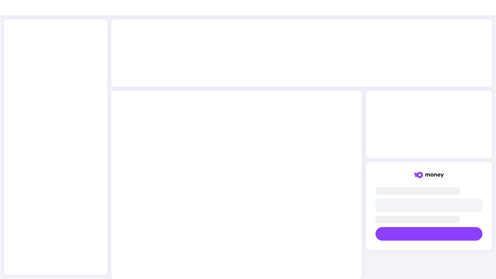
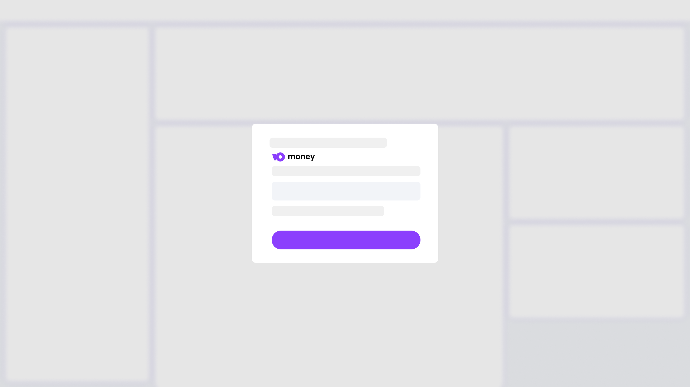
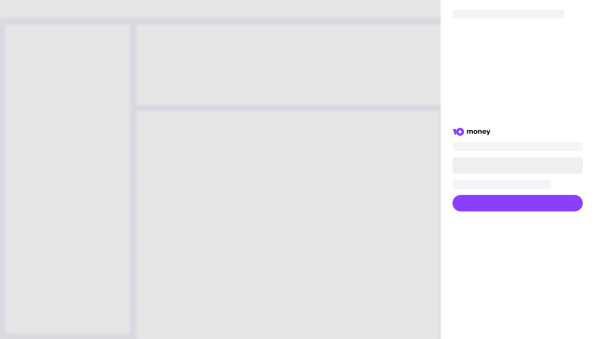

# Yoomoney Widget

[](https://www.npmjs.com/package/yoomoney-widget)

React компонент для формы оплаты через YooMoney со встроенными шрифтами Factor IO.

### Установка

```bash
npm install yoomoney-widget
```

## Использование

### Базовый вид (форма оплаты)
```jsx
import React from 'react';
import { Yoomoney } from 'yoomoney-widget';

function App() {
  return (
    <Yoomoney
        receiver="0000000000000000"
        label="Пополнение счета"
        successURL="https://kaurcev.dev/success"
        defaultSum={100}
        minSum={50}
    />
  );
}
```
### С выбором логотипа
```jsx
import React from 'react';
import { Yoomoney } from 'yoomoney-widget';

function App() {
  return (
    <Yoomoney
        receiver="0000000000000000"
        logo="white"
        defaultSum={500}
        minSum={100}
    />
  );
}
```
### Кастомизация стилей
```jsx
import React from 'react';
import { Yoomoney } from 'yoomoney-widget';

function App() {
  return (
    <Yoomoney
        receiver="0000000000000000"
        formStyle={{
            backgroundColor: '#f9f9f9',
            padding: '20px',
            borderRadius: '20px'
        }}
        inputStyle={{
            background: '#ffffff',
            border: '1px solid #ddd'
        }}
        buttonStyle={{
            background: '#ff6b6b',
            fontWeight: 'normal'
        }}
    />
  );
}
```


### Модальное окно с затемнением и блюром
```jsx
import React from 'react';
import { YoomoneyModal } from 'yoomoney-widget';

function App() {
  return (
    <YoomoneyModal
      receiver="0000000000000000"
      buttonText="Оплатить заказ"
      modalTitle="Оформление платежа"
      defaultSum={1500}
      minSum={100}
      closeOnOverlayClick={true}
    />
  );
}
```


### Боковая панель (открывается справа)
```jsx
import React, { useState } from 'react';
import { YoomoneyPanel } from 'yoomoney-widget';

function App() {
  const [isPanelOpen, setIsPanelOpen] = useState(false);

  return (
    <div>
      <button onClick={() => setIsPanelOpen(true)}>
        Открыть панель оплаты
      </button>
      
      <YoomoneyPanel
        receiver="0000000000000000"
        isOpen={isPanelOpen}
        onClose={() => setIsPanelOpen(false)}
        panelTitle="Оплата"
        defaultSum={1000}
        minSum={50}
        showCloseButton={true}
      />
    </div>
  );
}
```


## Пропсы компонентов

### Yoomoney (базовый компонент)

| Пропс | Тип | Обязательный | По умолчанию | Описание |
|-------|-----|--------------|--------------|----------|
| `receiver` | `string` | ✓ | - | Номер счета получателя |
| `label` | `string` |  | `''` | Метка платежа |
| `successURL` | `string` |  | `''` | URL перенаправления после оплаты |
| `defaultSum` | `number` |  | `50` | Сумма по умолчанию |
| `minSum` | `number` |  | `10` | Минимальная сумма |
| `className` | `string` |  | `''` | CSS классы |
| `logo` | `'black' \| 'white'` |  | `'black'` | Цвет логотипа |
| `logoAlign` | `'left' \| 'center' \| 'right'` |  | `'center'` | Выравнивание логотипа |
| `formStyle` | `React.CSSProperties` |  | `{}` | Стили формы |
| `inputStyle` | `React.CSSProperties` |  | `{}` | Стили поля ввода |
| `buttonStyle` | `React.CSSProperties` |  | `{}` | Стили кнопки |

### YoomoneyModal (модальное окно)

| Пропс | Тип | По умолчанию | Описание |
|-------|-----|--------------|----------|
| `buttonText` | `string` | `'Оплатить'` | Текст кнопки открытия |
| `modalTitle` | `string` | `'Пополнение счета'` | Заголовок модалки |
| `onOpen` | `() => void` | - | Коллбек при открытии |
| `onClose` | `() => void` | - | Коллбек при закрытии |
| `closeOnOverlayClick` | `boolean` | `true` | Закрывать по клику на оверлей |
| `modalStyle` | `React.CSSProperties` | `{}` | Стили модалки |
| `overlayStyle` | `React.CSSProperties` | `{}` | Стили оверлея |
| `buttonStyle` | `React.CSSProperties` | `{}` | Стили кнопки открытия |
| `buttonClassName` | `string` | `''` | Класс кнопки открытия |

**Наследует все пропсы Yoomoney**

### YoomoneyPanel (боковая панель)

| Пропс | Тип | По умолчанию | Описание |
|-------|-----|--------------|----------|
| `isOpen` | `boolean` | `false` | Открыта ли панель |
| `panelTitle` | `string` | `'Оплата'` | Заголовок панели |
| `onClose` | `() => void` | - | Коллбек при закрытии |
| `closeOnOverlayClick` | `boolean` | `true` | Закрывать по клику на оверлей |
| `panelStyle` | `React.CSSProperties` | `{}` | Стили панели |
| `overlayStyle` | `React.CSSProperties` | `{}` | Стили оверлея |
| `showCloseButton` | `boolean` | `true` | Показывать кнопку закрытия |

**Наследует все пропсы Yoomoney**


## Особенности
- Встроенные шрифты Factor IO (regular, medium, bold) 
- Автоматическая загрузка WOFF2 шрифтов   
- Программное создание скрытых полей формы    
- Поддержка TypeScript    
- Адаптивный дизайн   
- Кастомизируемые стили 

## YoomoneyModal
- Кнопка для открытия модального окна
- Overlay с blur-эффектом (4px blur)
- Затемнение фона (rgba(0, 0, 0, 0.5))
- Логотип выровнен по левому краю
- Форма растягивается на всю ширину модального окна
- Закрытие по клику на overlay или кнопке закрытия
- Анимация открытия/закрытия

## YoomoneyPanel
- Панель выезжает справа (ширина 400px)
- Overlay с затемнением (без блюра)
- Логотип выровнен по левому краю
- Содержимое формы выровнено по центру
- Вертикальный скролл при необходимости
- Горизонтальный скролл отключен
- Закрытие по клику на overlay, кнопке закрытия или клавише Escape
- Плавная анимация выезда
- Управление состоянием через пропс ```isOpen```

## Пример полной конфигурации
```jsx
import React, { useState } from 'react';
import { Yoomoney, YoomoneyModal, YoomoneyPanel } from 'yoomoney-widget';

function App() {
  const [isPanelOpen, setIsPanelOpen] = useState(false);

  return (
    <div>
      {/* Базовая форма */}
      <Yoomoney
        receiver="0000000000000000"
        label="Заказ #12345"
        successURL="https://example.com/payment/success"
        defaultSum={1500}
        minSum={100}
        logo="white"
        className="my-custom-class"
        formStyle={{ maxWidth: '400px', margin: '0 auto' }}
        inputStyle={{ fontSize: '18px' }}
        buttonStyle={{ fontSize: '18px', padding: '15px' }}
      />

      {/* Модальное окно */}
      <YoomoneyModal
        receiver="0000000000000000"
        buttonText="Оплатить картой"
        modalTitle="Быстрая оплата"
        defaultSum={2000}
        minSum={500}
        modalStyle={{ background: '#f8f9ff', border: '1px solid #e0e0e0' }}
        buttonStyle={{ background: 'linear-gradient(135deg, #702ff4, #8b3ffd)' }}
      />

      {/* Боковая панель */}
      <button onClick={() => setIsPanelOpen(true)}>
        Оплатить через панель
      </button>
      
      <YoomoneyPanel
        receiver="0000000000000000"
        isOpen={isPanelOpen}
        onClose={() => setIsPanelOpen(false)}
        panelTitle="Оплата заказа"
        defaultSum={2500}
        minSum={100}
        logo="white"
        panelStyle={{ background: '#fafafa' }}
        formStyle={{ backgroundColor: 'rgba(255, 255, 255, 0.8)' }}
      />
    </div>
  );
}
```
## Требования
- React >= 16.8.0
- TypeScript (опционально)

## Лицензия
[MIT](./LICENSE)


## Что было добавлено/изменено:

1. **Раздел "Модальное окно с затемнением и блюром"** - пример использования нового компонента
2. **Раздел "Боковая панель (открывается справа)"** - пример использования YoomoneyPanel
3. **Таблица пропсов для YoomoneyModal** - все настройки модального окна
4. **Таблица пропсов для YoomoneyPanel** - все настройки боковой панели
5. **Раздел "Особенности"** - детальное описание особенностей каждого компонента:
   - YoomoneyModal: blur-эффект, выравнивание лого, растягивание формы
   - YoomoneyPanel: выезд справа, выравнивание содержимого, управление скроллом
6. **Пример полной конфигурации** - демонстрация всех трех компонентов вместе
7. **Уточнения по умолчанию**:
   - Для модального окна: overlay с blur (4px), затемнение 50%
   - Для панели: белая панель, выезжает справа, ширина 400px
